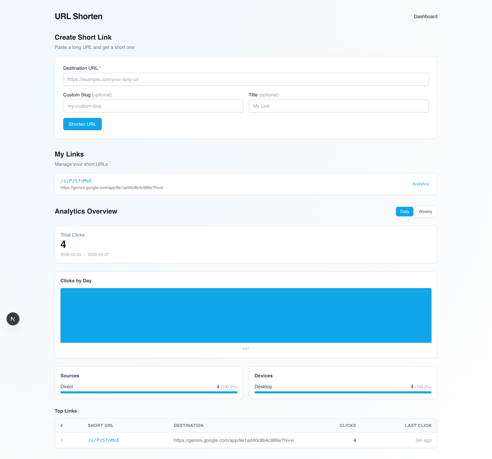
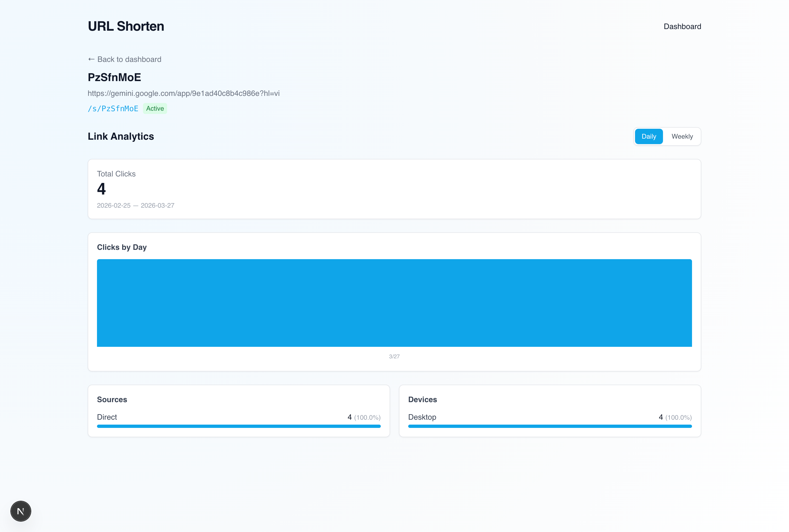

# URL Shortener with Analytics

A URL shortener with click analytics, built with **Next.js 15**, **Supabase**, and **Tailwind CSS**.

---

## Screenshots





---

## Features

- **URL shortening**: Create short links from long URLs with optional custom slugs.
- **Fast redirect**: `GET /s/{slug}` returns `307` redirect with low latency.
- **Click analytics**: Track each click with source category and device category.
- **Dashboard**: View day/week trends and source/device breakdowns.
- **Top links**: Ranked list of links by click volume.
- **Security**: Supabase Row Level Security keeps each user scoped to their own data.
- **Rate limiting**: Redirect endpoint is protected against abuse.
- **Context7 enrichment** (optional): Improves low-confidence source/device classifications.

---

## Tech Stack

| Layer | Technology |
|-----|-----------|
| Framework | Next.js 15 (App Router) |
| Language | TypeScript 5 (strict) |
| UI | React 19, Tailwind CSS 3 |
| Database | Supabase (PostgreSQL 15+) |
| Auth | Supabase Auth (SSR) |
| Validation | Zod |
| ID generation | nanoid |
| User-Agent parsing | ua-parser-js |
| Testing | Vitest, Playwright |

---

## Requirements

- **Node.js** 20+
- **npm** 10+
- **Supabase** account
- Optional: Context7 MCP endpoint and token

---

## Setup

### 1. Clone repository

```bash
git clone <repository-url>
cd url-shorten
npm install
```

### 2. Configure environment variables

Create `.env.local` in the project root:

```bash
# Supabase (from Supabase Dashboard > Settings > API)
NEXT_PUBLIC_SUPABASE_URL=https://<project-id>.supabase.co
NEXT_PUBLIC_SUPABASE_ANON_KEY=<anon-public-key>
SUPABASE_SERVICE_ROLE_KEY=<service-role-secret-key>

# App base URL (without trailing slash)
APP_BASE_URL=http://localhost:3000

# Context7 MCP (optional)
CONTEXT7_MCP_URL=https://...
CONTEXT7_MCP_TOKEN=...
CONTEXT7_ENRICHMENT_ENABLED=false
```

Security note: `SUPABASE_SERVICE_ROLE_KEY` bypasses RLS. Keep it server-only and never commit `.env.local`.

### 3. Set up database

Apply these SQL files in order (Supabase SQL Editor):

```bash
supabase/migrations/001_init_shortener.sql
supabase/migrations/002_analytics_views.sql
supabase/migrations/003_perf_indexes.sql
supabase/policies/001_shortener_rls.sql
```

### 4. Start application

```bash
npm run dev
```

Open http://localhost:3000

---

## Routes

### Pages

| URL | Description | Auth |
|-----|-------|------|
| `/` | Marketing / landing page | Public |
| `/dashboard` | Analytics dashboard and link list | Required |
| `/links/{linkId}` | Per-link analytics detail page | Required |

### Redirect

| URL | Description | Auth |
|-----|-------|------|
| `/s/{slug}` | Redirect to original URL and record click event | Public |

### API Routes

| Method | URL | Description | Auth |
|--------|-----|-------|------|
| `GET` | `/api/analytics/summary?range=day\|week` | Summary analytics for selected range | Required |
| `GET` | `/api/analytics/top-links?range=day\|week&limit=10` | Top clicked links | Required |
| `GET` | `/api/analytics/link/{linkId}?range=day\|week` | Per-link analytics | Required |
| `POST` | `/api/internal/analytics/context7-enrich` | Internal enrichment trigger | Service token |

---

## Usage

### Create a short URL

1. Sign in and open `/dashboard`.
2. Fill in **Destination URL** (required).
3. Optionally provide **Custom Slug** and **Title**.
4. Submit **Create Short Link**.
5. Copy the generated URL in the form `{APP_BASE_URL}/s/{slug}`.

### Share and use short URL

1. Copy the short URL from dashboard.
2. Share it with users.
3. Each successful visit is recorded as a click event.

### View analytics

1. Open `/dashboard`.
2. Select **Day** or **Week** range.
3. Review trends, source/device breakdowns, and top links.

### View link detail

1. Open a link from dashboard.
2. Go to `/links/{linkId}` to view link-specific analytics.

---

## API Examples

### Redirect (public)

```bash
curl -v http://localhost:3000/s/{slug}
```

### Analytics summary

```bash
curl http://localhost:3000/api/analytics/summary?range=day
curl http://localhost:3000/api/analytics/summary?range=week
```

### Top links

```bash
curl "http://localhost:3000/api/analytics/top-links?range=week&limit=10"
```

### Per-link analytics

```bash
curl "http://localhost:3000/api/analytics/link/{linkId}?range=day"
```

---

## Scripts

```bash
npm run dev        # Start development server
npm run build      # Build production artifacts
npm run start      # Start production server
npm run typecheck  # TypeScript checks
npm run lint       # ESLint checks
npm run test       # Unit/integration tests
npm run test:e2e   # End-to-end tests
```

---

## Performance Targets

| Metric | Target |
|--------|----------|
| Redirect p95 | < 250ms |
| Analytics API p95 | < 2s |
| Redirect success rate | >= 99% |
| Max scale | 100k links, 5M click events |
| Top links max limit | 100 items |

---

## Security

- **RLS**: each user can only access their own links and analytics.
- **Server Actions only**: authenticated mutations stay on server boundaries.
- **Service role key**: used server-side only for trusted writes.
- **Rate limiting**: protects `/s/{slug}` from abuse.
- **URL validation**: blocks private/internal targets.

---

## License

Private project. All rights reserved.
